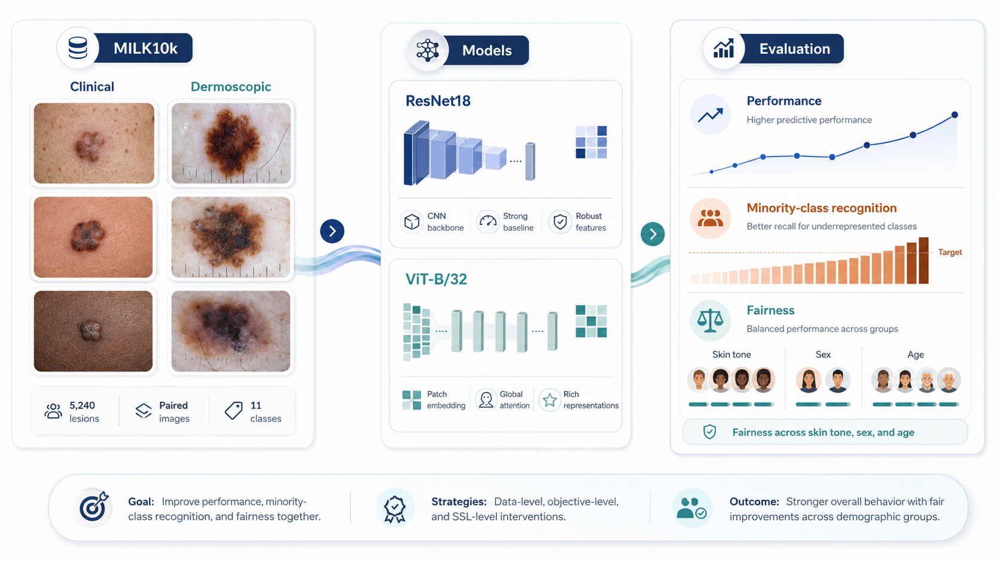
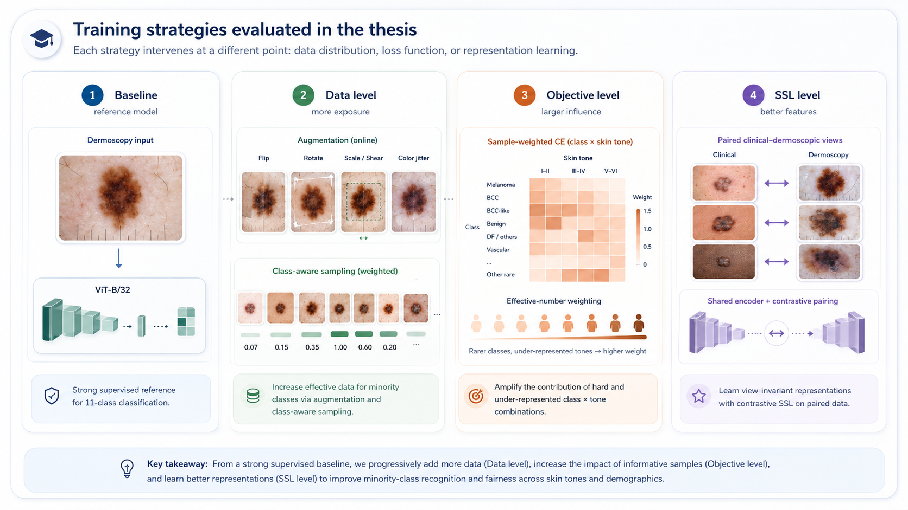
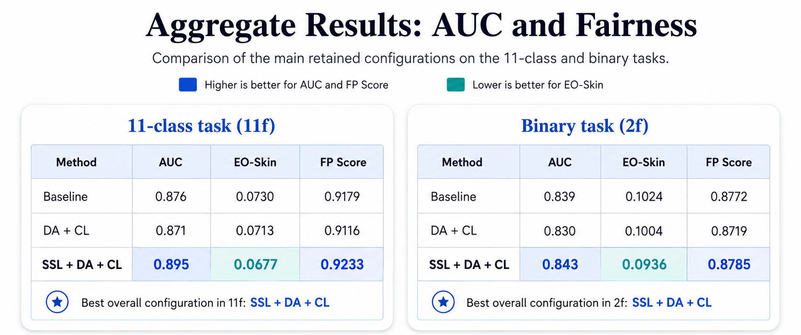
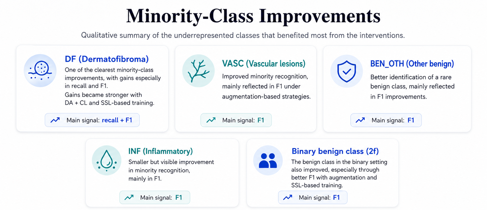

# Fairness-Aware Skin Lesion Classification with MILK10k

This repository contains the code developed for a bachelor thesis **Towards Fair and Inclusive Skin Lesion Classification Systems** using the **MILK10k** dataset. The project evaluates how model architecture, image modality and training strategy affect three connected objectives in dermatological AI:

1. **Predictive performance**, measured mainly through AUC.
2. **Minority-class recognition**, measured through class-level precision, recall and F1-score.
3. **Subgroup consistency**, measured through Equal Opportunity gaps across skin tone, sex and age.

The central motivation is that a model can obtain strong aggregate performance while still performing unevenly across diagnostic classes or demographic subgroups. For that reason, this repository does not only report accuracy-oriented results. It compares each configuration using both predictive and fairness-oriented metrics, with a final Fairness-Performance Score used to summarize the trade-off.

> This code is intended for research and reproducibility purposes only. It is not a clinical diagnostic tool.

<p align="center">
  
</p>

---

## Project Scope

The study is organized around three experimental questions.

| Question | Purpose |
| --- | --- |
| Which supervised baseline is the strongest reference point? | Establish a solid comparison point before testing fairness-aware interventions. |
| Do supervised imbalance strategies improve fairness? | Test whether class-aware augmentation and subgroup-aware loss weighting reduce unfair behavior. |
| Does multimodal self-supervised learning help? | Use paired clinical and dermoscopic images to learn stronger representations before fine-tuning. |

The final experiments focus on the selected **dermoscopic ViT-B/32** configuration and evaluate the retained strategies in two task formulations:

- **11-class classification**, using the full diagnostic grouping.
- **Binary classification**, grouping diagnoses into benign and malignant categories.

---

## Dataset

The project uses **MILK10k**, a paired multimodal skin lesion dataset released through the ISIC Challenge platform. Each lesion includes:

- one **clinical close-up image**,
- one **dermoscopic image**,
- diagnostic labels,
- demographic metadata, including **skin tone**, **sex** and **age**.

The official challenge test labels are not publicly available, so this repository builds a new **lesion-aware train/validation/test split** from the labelled training data. This ensures that the two images belonging to the same lesion are always assigned to the same split.

Official resources:

- [MILK10k benchmark page](https://challenge.isic-archive.com/landing/milk10k/)
- [ISIC Challenge data page](https://challenge.isic-archive.com/data/)
- [MILK10k dataset DOI](https://doi.org/10.34970/648456)
- [MILK10k dataset descriptor](https://doi.org/10.1016/j.jid.2025.06.1594)

Expected local layout:

```text
data/raw/
|-- MILK10k_Training_Input.zip
|-- MILK10k_Training_Metadata.csv
`-- MILK10k_Training_GroundTruth.csv
```

Raw data, processed data, model checkpoints and generated outputs are excluded from version control.

---

## Methodology

<p align="center">
  
</p>

The repository compares interventions applied at different stages of the learning pipeline. This separation is important because class imbalance, subgroup imbalance and representation quality are related problems, but they are not equivalent.

### 1. Supervised Baseline Selection

The first stage compares standard supervised configurations in order to avoid using an arbitrary baseline. The evaluated factors are:

- **Backbone**: ResNet18 and ViT-B/32.
- **Image modality**: clinical and dermoscopic images.
- **Task formulation**: 11-class and binary classification.
- **Training objective**: standard cross-entropy.

The selected reference configuration for the intervention experiments is the **dermoscopic ViT-B/32**, which provides the strongest overall baseline behavior under the final evaluation criterion.

### 2. Online Data Augmentation and Class-Aware Sampling

The data-level strategy aims to increase the effective presence of underrepresented diagnostic classes during training.

It combines:

- online image augmentation,
- a class-aware repeat factor capped at 6,
- a `WeightedRandomSampler` based on class frequency.

The transformations are designed to remain compatible with dermatological image classification:

- horizontal and vertical flips,
- small rotations,
- affine scaling,
- shear,
- moderate color jitter.

This strategy mainly targets **class imbalance**. It can improve recognition of rare diagnostic classes, but it does not directly guarantee fairer behavior across demographic subgroups.

### 3. Sample-Weighted Cross-Entropy

The objective-level strategy uses `SampleWeightedCrossEntropy`, where each sample receives a weight based on its **class × skin-tone** pair. The goal is to make the loss more sensitive to combinations that are underrepresented in the training set.

The pair weights are computed using effective-number reweighting and then normalized. The selected beta values are:

| Task | Beta |
| --- | ---: |
| 11-class | `0.999` |
| Binary | `0.99` |

This strategy targets subgroup imbalance more directly than data augmentation. However, its effect depends on how sparse each class-subgroup combination is, so improvements in EO-Skin may come with trade-offs in AUC, EO-Sex or EO-Age.

### 4. Multimodal Self-Supervised Learning

The representation-level strategy uses the paired structure of MILK10k before supervised fine-tuning.

For each lesion:

- the clinical image and the dermoscopic image form a **positive pair**,
- images from other lesions in the batch act as **negative pairs**,
- a shared encoder is trained with a symmetric bidirectional NT-Xent loss,
- the projection head is discarded after pretraining,
- the encoder initializes the downstream supervised model.

This stage is intended to learn a representation that captures lesion-level information beyond a single image modality. In the final experiments, this was the most effective intervention for improving the global fairness-performance trade-off.

---

## Metrics

The evaluation uses both predictive and fairness-oriented metrics.

| Metric | Meaning | Direction |
| --- | --- | --- |
| Accuracy | Fraction of correct predictions | Higher is better |
| AUC | Ranking/discrimination quality | Higher is better |
| EO-Skin | Equal Opportunity gap across skin-tone groups | Lower is better |
| EO-Sex | Equal Opportunity gap across sex groups | Lower is better |
| EO-Age | Equal Opportunity gap across age groups | Lower is better |
| 1 - Avg. EO | Complement of the average EO gap | Higher is better |
| FP Score | Weighted combination of AUC and 1 - Avg. EO | Higher is better |

The Fairness-Performance Score is defined as:

```text
FP Score = alpha * AUC + (1 - alpha) * (1 - Avg. EO)
```

with `alpha = 0.4`. This gives slightly more weight to subgroup consistency than to pure predictive discrimination.

During supervised training, the best checkpoint is selected using validation AUC. The FP Score is used afterward to compare final configurations under a fairness-oriented criterion.

---

## Main Results

<p align="center">
  
</p>

<p align="center">
  
</p>

The results show that fairness-aware skin lesion classification cannot be reduced to a single intervention. Different strategies affect different parts of the problem.

| Setting | Main observation |
| --- | --- |
| Baseline selection | ViT-based models achieved strong AUC, but the most accurate configuration was not always the most balanced across subgroups. |
| Data augmentation | Improved several minority-class F1 scores, especially in the 11-class setting, but did not improve the global FP Score by itself. |
| Custom loss | Targeted class × skin-tone imbalance more directly, but the effect was partial and did not reduce all subgroup gaps uniformly. |
| DA + CL | Reduced EO-Skin slightly in both task settings, but introduced trade-offs in AUC and the final FP Score. |
| SSL + DA + CL | Produced the strongest 11-class result and the best EO-Skin values among the selected final configurations. |

Selected aggregate results:

| Task | Method | AUC | EO-Skin | FP Score |
| --- | --- | ---: | ---: | ---: |
| 11f | Baseline | 0.876 | 0.0730 | 0.9179 |
| 11f | DA + CL | 0.871 | 0.0713 | 0.9116 |
| 11f | SSL + DA + CL | **0.895** | **0.0677** | **0.9233** |
| 2f | Baseline | 0.839 | 0.1024 | 0.8772 |
| 2f | DA + CL | 0.830 | 0.1004 | 0.8719 |
| 2f | SSL + DA + CL | **0.843** | **0.0936** | **0.8785** |

### Result Interpretation

The most important conclusion is that supervised imbalance techniques did not behave as simple fairness fixes. Data augmentation and class-aware sampling helped the model see minority diagnostic classes more often, but this did not automatically translate into lower subgroup gaps. Similarly, the custom loss addressed class × skin-tone imbalance more explicitly, but sparse subgroup combinations made the effect uneven.

The best global behavior came from the SSL-based configuration. In the 11-class setting, `SSL + DA + CL` improved AUC, reduced EO-Skin and achieved the highest FP Score among the selected final experiments. In the binary setting, the gains were smaller but still consistent: the SSL-based configuration obtained the best AUC, the lowest EO-Skin and the highest FP Score among the compared final methods.

Overall, the experiments suggest that improving fairness in this setting requires more than rebalancing the supervised training distribution. Better multimodal representations can make the downstream classifier more robust before fairness-aware fine-tuning is applied.

---

## Repository Layout

```text
configs/                 YAML configs for 11-class and binary experiments
scripts/                 Command-line entrypoints
assets/                  README figures
src/milk10k/data/        Dataset construction, labels, transforms and PyTorch datasets
src/milk10k/eda/         Basic exploratory analysis utilities
src/milk10k/evaluation/  Predictive and fairness metrics
src/milk10k/models/      Supervised backbones and multimodal SSL model
src/milk10k/training/    Training loop, losses and experiment strategies
src/milk10k/utils/       Configuration and reproducibility helpers
```

---

## Environment Setup

Python `>=3.10` is expected. A CUDA-enabled GPU is recommended for ViT and SSL experiments.

```bash
pip install -r requirements.txt
pip install -e .
```

If a specific CUDA build is required, install PyTorch from the official PyTorch selector before installing the remaining dependencies.

---

## Execution Guide

Run all commands from the repository root.

### 1. Build the Processed Dataset

```bash
python scripts/build_milk10k_dataset.py --raw-dir data/raw --output-dir data/processed
```

This creates the master table, lesion-aware train/validation/test CSV splits and optional image-folder exports for the 11-class and binary formulations.

### 2. Generate Basic EDA Figures

```bash
python scripts/run_eda.py --master-csv data/processed/master_table.csv --output-dir outputs/eda
```

This generates class-distribution, metadata-distribution and paired-example figures.

### 3. Run the 11-Class Experiments

```bash
python scripts/run_baseline.py --config configs/baseline.yaml
python scripts/run_data_augmentation.py --config configs/data_augmentation.yaml
python scripts/run_custom_loss.py --config configs/custom_loss.yaml
python scripts/run_aug_plus_loss.py --config configs/aug_plus_loss.yaml
python scripts/run_ssl.py --config configs/ssl.yaml
```

### 4. Run the Binary Experiments

```bash
python scripts/run_baseline.py --config configs/baseline_2f.yaml
python scripts/run_data_augmentation.py --config configs/data_augmentation_2f.yaml
python scripts/run_custom_loss.py --config configs/custom_loss_2f.yaml
python scripts/run_aug_plus_loss.py --config configs/aug_plus_loss_2f.yaml
python scripts/run_ssl.py --config configs/ssl_2f.yaml
```

---

## Experiment Configurations

| Config | Task | Strategy | Key settings |
| --- | --- | --- | --- |
| `baseline.yaml` | 11f | Supervised baseline | ViT-B/32, dermoscopic, BS 32, LR 3e-5 |
| `baseline_2f.yaml` | 2f | Supervised baseline | ViT-B/32, dermoscopic, BS 16, LR 3e-5 |
| `data_augmentation.yaml` | 11f | Online DA + class sampler | BS 128, repeat cap 6 |
| `data_augmentation_2f.yaml` | 2f | Online DA + class sampler | BS 64, repeat cap 6 |
| `custom_loss.yaml` | 11f | Class × skin-tone weighted CE | beta 0.999 |
| `custom_loss_2f.yaml` | 2f | Class × skin-tone weighted CE | beta 0.99 |
| `aug_plus_loss.yaml` | 11f | DA + custom loss | BS 128, beta 0.999 |
| `aug_plus_loss_2f.yaml` | 2f | DA + custom loss | BS 64, beta 0.99 |
| `ssl.yaml` | 11f | SSL + DA + CL | NT-Xent temperature 0.10 |
| `ssl_2f.yaml` | 2f | SSL + DA + CL | NT-Xent temperature 0.10 |

---

## Outputs

Each experiment writes its outputs under `outputs/<experiment_name>/`:

```text
outputs/<experiment_name>/
|-- best_model.pt
|-- summary.csv
`-- per_class.csv
```

- `summary.csv` contains aggregate predictive and fairness metrics.
- `per_class.csv` contains class-level precision, recall, F1-score and support.

Generated outputs and checkpoints are ignored by Git to keep the repository lightweight.

---

## Reproducibility Notes

The YAML files contain the final hyperparameters used by the retained experiments. Exact numerical reproduction may still vary across hardware, CUDA versions, PyTorch versions and nondeterministic GPU kernels.

The official MILK10k challenge test labels are not used because they are not publicly available. All reported experiments use a lesion-aware split generated from the labelled training data.

---

## Citation

If you use MILK10k, cite the official dataset:

```text
MILK study team. MILK10k. ISIC Archive, 2025. doi:10.34970/648456.
```

Dataset descriptor:

```text
Tschandl P. et al. MILK10k: A hierarchical multimodal imaging-learning toolkit
for diagnosing pigmented and nonpigmented skin cancer and its simulators.
Journal of Investigative Dermatology, 2026.
```

---

## License

This repository contains code and schematic figures. MILK10k data are distributed separately by ISIC under their own license and terms of use.
